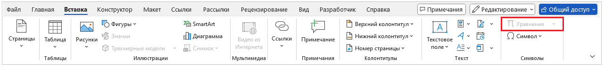
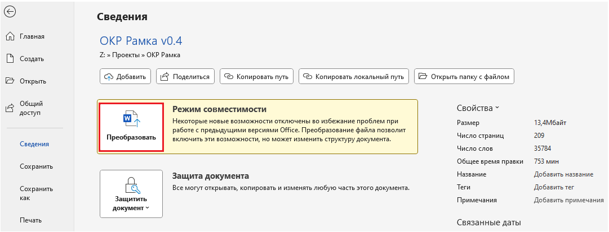

---
tags:
  - help
  - word
---

# В Word не активна кнопка **Уравнение**

1. Нажмите **Файл** → Сведения. 

2. Нажмите кнопку **Преобразовать** в разделе Режим совместимости. 
  

3. Нажмите **ОК**. Файл будет преобразован в формат .docx.

После преобразования кнопка **Уравнение** станет активной.