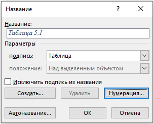

---
tags:
  - help
  - word
---

# Нумерация таблиц и рисунков с заданного номера
  
## Нумерация с произвольного номера
  
1. Вставьте стандартную подпись. Вставьте → Надпись → Таблица (или Рисунок). В документе появится, например, Таблица 1
  
2. Перейдите в режим редактирования поля:

    * Выделите номер (только цифру 1). 
      
    * Нажмите Shift+F9, чтобы отобразить код поля. Вместо номера появится конструкция вида { SEQ Таблица \* ARABIC } или нажмите ЛКМ на номер -> выбери Коды/значения полей.
   
3. Добавьте параметр \r для сдвига нумерации:
      
    * Измените код поля, добавив параметр \r N, где N — нужный начальный номер.
      
    * Пример: Для начала нумерации с 24 код должен выглядеть так:
      
      { SEQ Таблица \* ARABIC\r 24 }
      
      Параметр \r 24 означает: начать отсчет с 24, а следующий элемент будет 25).
   
4. Обновите поле и выйдите из режима кода:
      
    * Щелкни внутри кода поля и нажмите F9 для обновления. Номер в документе изменится на 25.
      
    * Нажмите Shift+F9 еще раз, чтобы скрыть код и вернуться к обычному отображению, если использовали на шаге 2 эту комбинацию, а не ЛКМ.
   
5. Следующая подпись будет пронумерована автоматически. При вставке следующей стандартной подписи Таблица (или Рисунок) Word продолжит последовательность с 25, 26 и т.д.

## Автоматическая нумерация с привязкой к главам

1. Создайте стили заголовков (например, Заголовок 1) для глав. 

2. Нажмите на рисунок/таблицу, с которой будет начинаться нумерация.
 
3. Нажмите кнопку **Вставить название** во вкладке Ссылки. 

4. В окне Название нажмите кнопку **Нумерация**. поставь галочку Включить номер главы -> выбери стиль заголовка главы (например, Заголовок 1) и разделитель (точка, тире)
  
5. Поставьте галочку Включить номер главы. 
 
6. Выберите стиль заголовка главы (например, Заголовок 1) и разделитель (точка, тире). 

7. Нажмите кнопку **ОК**. Номера будут формироваться как Глава.Номер (например, 1.1, 1.2, 2.1)
 
!