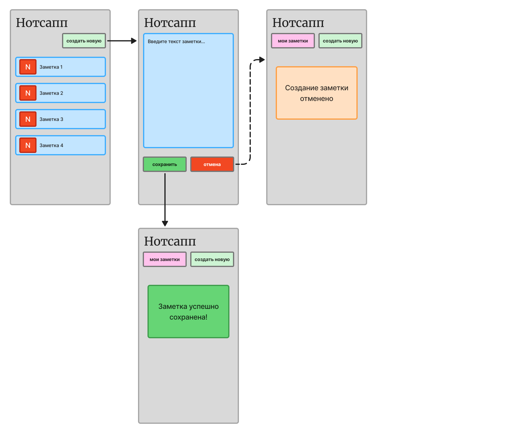
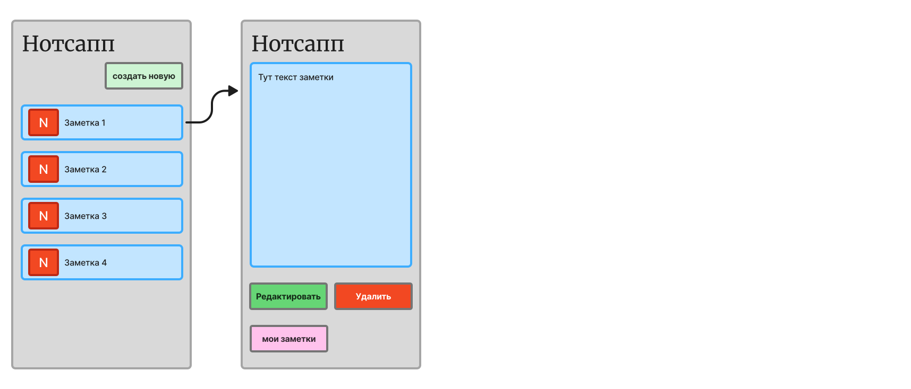
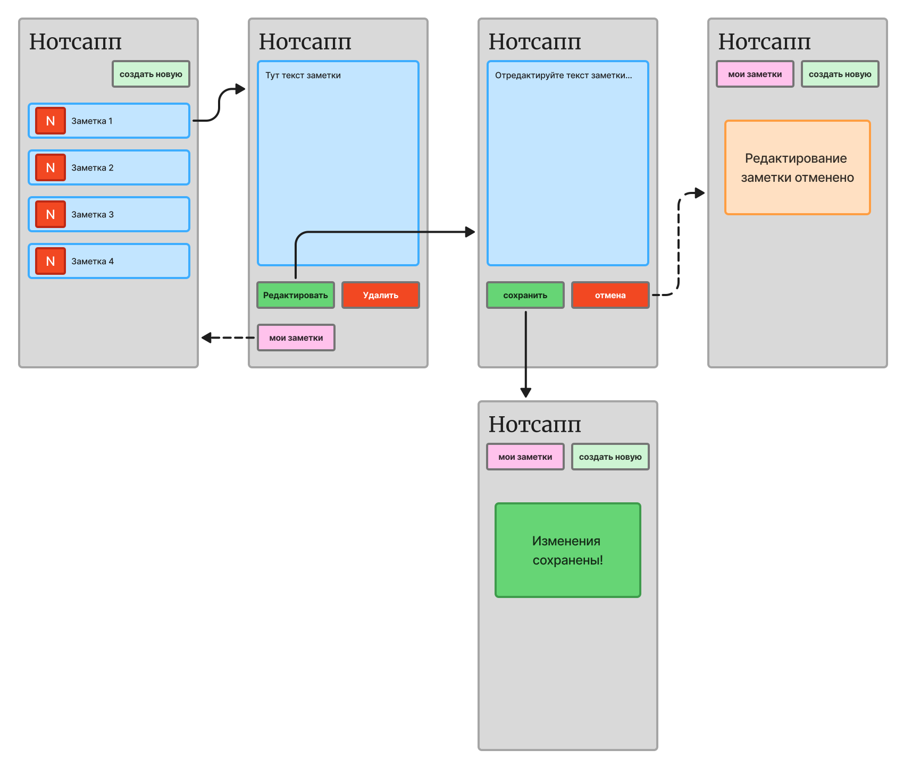
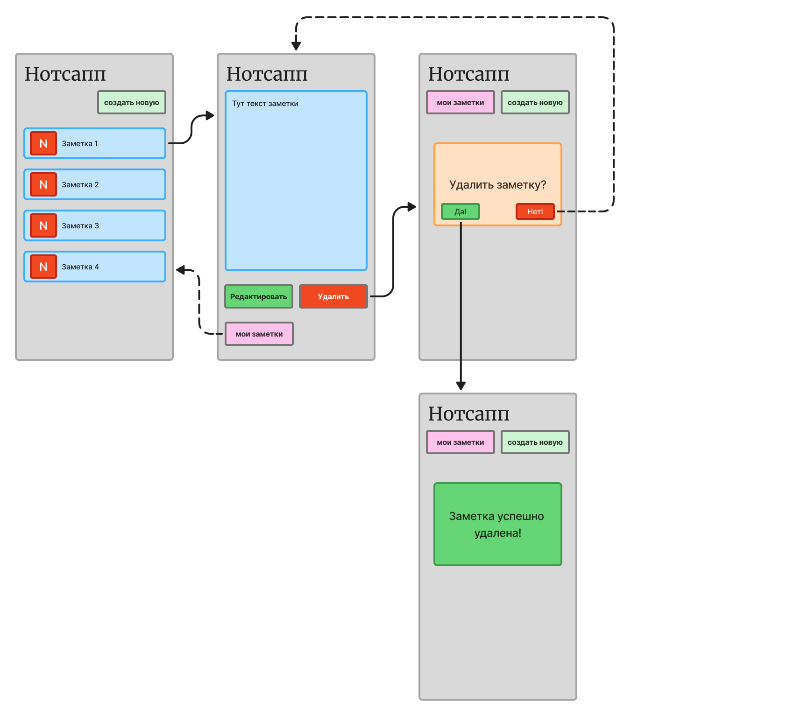

# Нотсапп. Спецификация

## О продукте

Нотсапп — это мобильное приложение для пользовательских заметок.

В Нотсаппе можно создавать, хранить и редактировать заметки.

## Архитектура системы

### Компоненты архитектуры

1. Frontend Application (приложение) — клиентская часть приложения, отвечает за отображение данных и обеспечивает взаимодействие приложения с пользователем.
2. Backend (бэк) — серверная часть приложения, отвечающая за реализацию функциональности системы.
3. Database (база данных) — база данных для хранения пользовательских заметок.

## Функциональные требования

### Создание новой заметки

Пользователь должен иметь возможность создать новую заметку. Система должна сохранить заметку и отображать её в списке заметок.

### Просмотр списка заметок

Система должна отображать список всех заметок пользователя в хронологическом порядке.

### Просмотр заметки

При выборе пользователем заметки из списка система должна открыть её в режиме просмотра.

### Редактирование заметки

Пользователь должен иметь возможность редактировать существующую заметку. Система должна сохранить изменения в заметке.

### Удаление заметки

Пользователь должен иметь возможность удалить выбранную заметку. Система должна удалить данные о заметке и не отображать её в списке заметок.

## Пользовательские сценарии

!!! note "Примечание"
    На схеме пользовательского сценария сплошными стрелками показан основной сценарий, пунктирными — альтернативный.

Все схемы сценариев вы можете посмотреть в [FigJam](https://www.figma.com/board/hbz6DW203odCVsCbPynTdZ/%D0%9F%D0%BE%D0%BB%D1%8C%D0%B7%D0%BE%D0%B2%D0%B0%D1%82%D0%B5%D0%BB%D1%8C%D1%81%D0%BA%D0%B8%D0%B5-%D1%81%D1%86%D0%B5%D0%BD%D0%B0%D1%80%D0%B8%D0%B8-%D0%9D%D0%BE%D1%82%D1%81%D0%B0%D0%BF%D0%BF?node-id=0-1&t=WA8zmCucuIfTUx3E-1){target=_blank}.

### 1. Создание новой заметки

### 2. Просмотр заметки

### 3. Редактирование заметки

### 4. Удаление заметки

