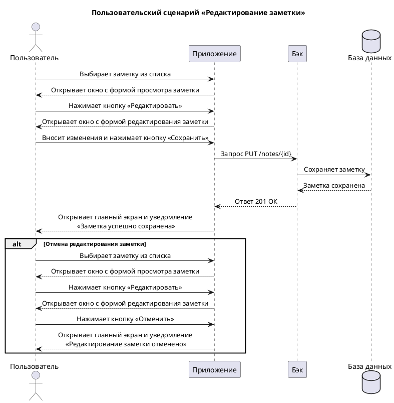

# Пользовательский сценарий «Редактирование заметки»

## Действующие лица

1. Пользователь.

2. Приложение.

3. Бэк.

4. База данных.

## Предварительные условия

1. Пользователь находится на главном экране.

2. В системе существует хотя бы одна заметка, созданная пользователем.

## Выходные условия

В системе появилась отредактированная заметка пользователя.

## Основной сценарий

1. Пользователь выбирает заметку из списка.

2. Приложение открывает форму просмотра заметки.

3. Пользователь нажимает кнопку **Редактировать**.

4. Приложение открывает форму редактирования заметки.

5. Пользователь вносит изменения в текст заметки.

6. Пользователь нажимает кнопку **Сохранить**.

7. Приложение отправляет запрос Бэку для сохранения изменений.

8. Бэк сохраняет изменения в Базе данных.

9. Бэк возвращает Приложению ответ об успешном сохранении.

10. Приложение  открывает пользователю главный экран и показывает уведомление «Заметка успешно сохранена».

## Альтернативный сценарий

1. Пользователь выбирает заметку из списка.

2. Приложение открывает окно с формой просмотра заметки.

3. Пользователь нажимает кнопку **Редактировать**.

4. Приложение открывает окно с формой редактирования заметки.

5. Пользователь вносит изменения в текст заметки.

6. Пользователь нажимает кнопку **Отменить**.

7. Приложение открывает пользователю главный экран и показывает уведомление «Редактирование заметки отменено».

## Диаграмма последовательности



??? note "Код диаграммы"
    ```puml
    @startuml
    title Пользовательский сценарий «Редактирование заметки»
    
    actor Пользователь
    participant Приложение
    participant Бэк
    database "База данных"

    Пользователь -> Приложение: Выбирает заметку из списка
    Пользователь <-- Приложение: Открывает окно с формой просмотра заметки
    Пользователь -> Приложение: Нажимает кнопку «Редактировать»
    Пользователь <-- Приложение: Открывает окно с формой редактирования заметки
    Пользователь -> Приложение: Вносит изменения и нажимает кнопку «Сохранить»
    Приложение -> Бэк: Запрос PUT /notes/{id}
    Бэк -> "База данных": Сохраняет заметку
    Бэк <-- "База данных": Заметка сохранена
    Бэк --> Приложение: Ответ 201 ОК
    Приложение -> Пользователь: Открывает главный экран и уведомление\n «Заметка успешно сохранена»

    alt Отмена редактирования заметки
    Пользователь -> Приложение: Выбирает заметку из списка
    Пользователь <-- Приложение: Открывает окно с формой просмотра заметки
    Пользователь -> Приложение: Нажимает кнопку «Редактировать»
    Пользователь <-- Приложение: Открывает окно с формой редактирования заметки
    Пользователь -> Приложение: Нажимает кнопку «Отменить»
    Приложение --> Пользователь: Открывает главный экран и уведомление\n «Редактирование заметки отменено» 
    end alt
    @enduml
    ```