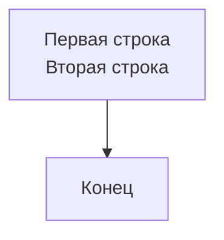
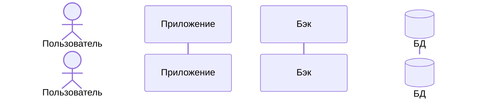
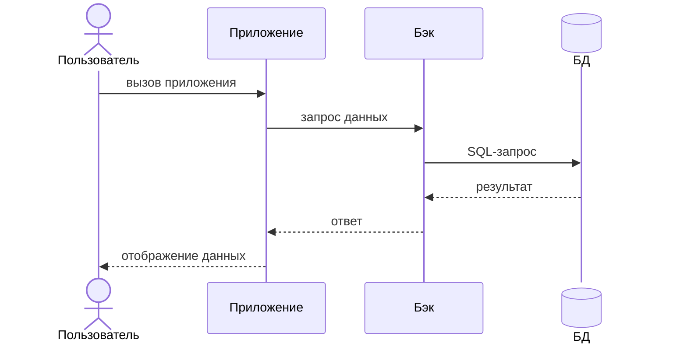
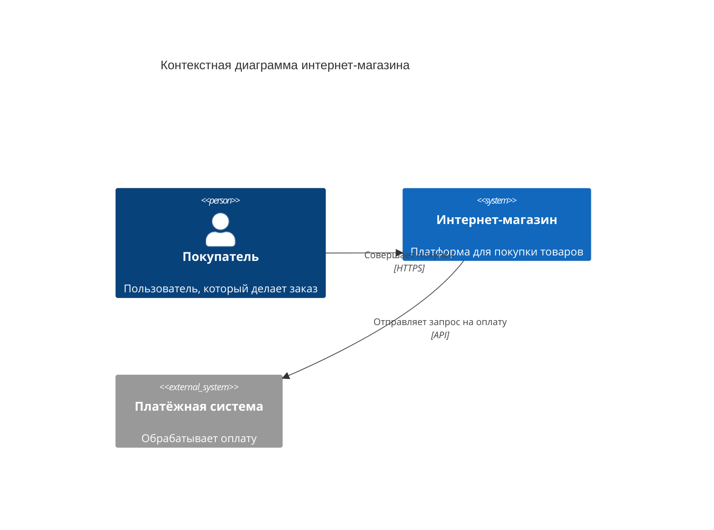
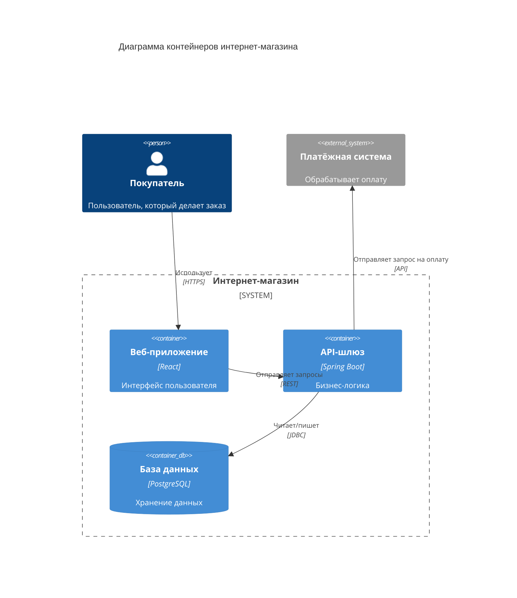
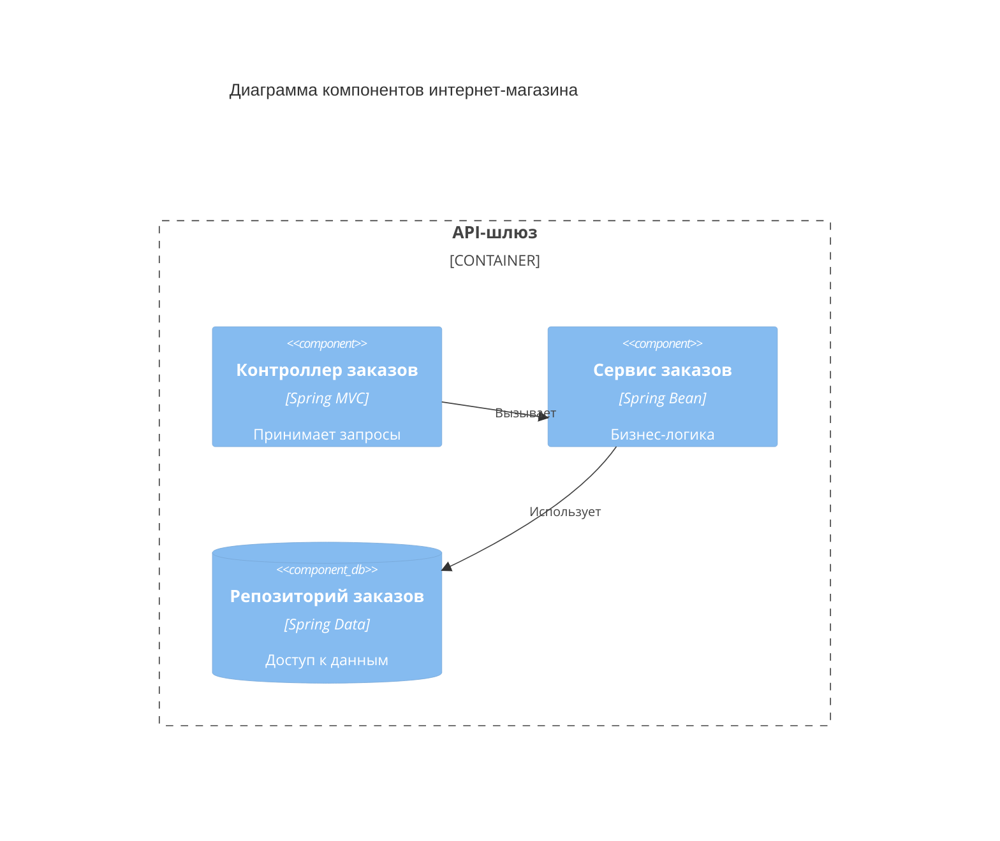
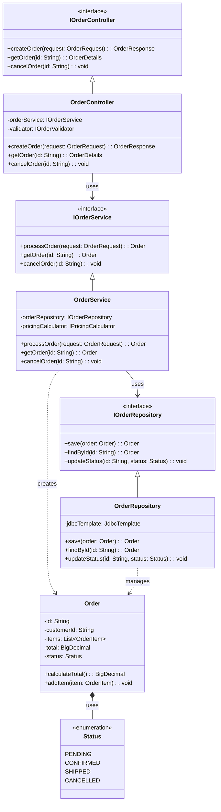

---
tags:
  - mermaid
  - help
  - manual
---

# Mermaid

Mermaid — инструмент для создания диаграмм и визуализаций с помощью текстового описания на основе JavaScript. Как и PlantUML, он позволяет хранить диаграммы в системе контроля версий, отслеживать изменения и автоматически генерировать их при сборке документации.

Mermaid поддерживает следующие типы диаграмм:

* диаграммы последовательности (sequence diagrams);

* диаграммы C4 (C4 diagrams);

* диаграммы состояний (state diagrams);

* диаграммы Ганта (Gantt charts);

* Git-графы (Git graphs);

* ER-диаграммы (Entity Relationship diagrams).


## Общий синтаксис Mermaid

Код диаграммы заключается в блок с указанием типа диаграммы:

```mermaid
<тип_диаграммы>
```
**Типы диаграмм**

| Тип диаграммы | Ключевое слово | Назначение |
| :--- | :--- | :--- |
| Блок-схема | `flowchart` | Визуализация алгоритмов, процессов и workflows |
| Диаграмма последовательности | `sequenceDiagram` | Взаимодействие объектов во времени |
| Диаграмма классов | `classDiagram` | Структура классов, их атрибуты и связи |
| Диаграмма состояний | `stateDiagram` или `stateDiagram-v2` | Состояния объекта и переходы между ними |
| Диаграмма Ганта | `gantt` | Планирование задач и проектов во времени |
| Диаграмма путешествия пользователя | `journey` | Пользовательские сценарии и их оценка |
| Git-граф | `gitGraph` | Визуализация ветвления и коммитов в Git |
| ER-диаграмма | `erDiagram` | Модели данных и связи между сущностями |
| Круговая диаграмма | `pie` | Процентное соотношение частей целого |
| Диаграмма требований | `requirementDiagram` | Требования и их связи |
| Диаграмма C4 | `C4Context`, `C4Container`, `C4Component`, `C4Dynamic` | Архитектурные диаграммы разных уровней |
| Mind-карта | `mindmap` | Иерархическая структура идей и концепций |
| Таймлайн | `timeline` | Хронологическая последовательность событий |
| XY-диаграмма | `xyChart` | Визуализация числовых данных на координатной плоскости |

### Общие команды

Для всех диаграмм доступны общие команды, управляющие отображением:

| Команда | Результат |
| :--- | :--- |
| `title` | Заголовок над диаграммой |
| `%%` | Однострочный комментарий |
| `%%{init: {...}}%%` | Глобальная конфигурация темы |

### Перенос строки

Для переноса строки в надписях используется HTML-тег `<br>`:

`````markdown

`````

### Комментарии

Для пояснений в коде диаграммы используются однострочные комментарии, начинающиеся с `%%`:

```
%% Текст комментария
```
!!! note "Примечание"
    В Mermaid нет многострочных комментариев. Для длинных пояснений используйте несколько однострочных комментариев `%%` подряд.

## Диаграмма последовательности

Диаграмма последовательности (sequence diagram) показывает взаимодействие между объектами: кто, в каком порядке и каким образом выполняет операции. С её помощью можно описать любой процесс в системе — от пользовательского сценария до внутреннего алгоритма.

### Объявление участников

Участники в диаграмме последовательности —  объекты системы, задействованные в описываемом процессе:

* Пользователь — actor (внешнее действующее лицо).

* База данных — participant с JSON-конфигурацией `@{ "type" : "database" }`.

* Другой объект — participant (любой внутренний компонент системы, например, модуль или сервис).

Участники объявляются в начале диаграммы в формате `тип_участника Имя_участника`:

`````markdown

`````

Порядок объявления участников определяет их расположение на диаграмме слева направо.

??? quote "Результат"
    ```mermaid
    sequenceDiagram
        actor Пользователь
        participant Приложение
        participant Бэк
        participant БД@{ "type" : "database" }
    ```

Для сокращения длинных имён в тексте сценария используется ключевое слово `as`, перед которым указывается псевдоним участника.

`````markdown
 ```mermaid
sequenceDiagram
    actor user as Пользователь
    participant БД as База данных
```
`````

??? quote "Результат"
    ```mermaid
    sequenceDiagram
        actor user as Пользователь
        participant БД as База данных
    ```

!!! warning "Важно!"
    Использовать `as` и `@{...}` одновременно нельзя. Это вызывает ошибку парсинга. 

### Описание действий

После объявления участников описываются взаимодействия между ними. В большинстве сценариев используются два типа действий:

* Синхронный вызов `->>` (запрос от одного участника к другому).

* Ответ на вызов `-->>` (возврат результата).

Взаимодействия двух участников описываются в формате:

* Вызов: `Участник-1 ->> Участник-2: Описание вызова`.

* Вызов: `Участник-2 -->> Участник-1: Описание ответа`.

`````

`````

??? quote "Результат"
    ```mermaid
    sequenceDiagram
        actor Пользователь
        participant Приложение
        participant Бэк
        participant БД@{ "type" : "database" }
       
        Пользователь ->> Приложение: вызов приложения
        Приложение ->> Бэк: запрос данных
        Бэк ->> БД: SQL-запрос
        БД -->> Бэк: результат
        Бэк -->> Приложение: ответ
        Приложение -->> Пользователь: отображение данных
    ```

### Альтернативные сценарии

Диаграмма последовательности позволяет отображать не только основной (успешный) сценарий, но и его альтернативные варианты.

Для группировки действий альтернативного сценария используется `alt`:

```go title="Пример"
sequenceDiagram
…
alt Альтернативный сценарий
Пользователь -> Приложение: отмена действия
Пользователь <-- Приложение: отображение главного экрана
end
…
```
??? quote "Результат"
    ```mermaid
    sequenceDiagram
        actor Пользователь
        participant Приложение
        participant Бэк
        participant БД@{ "type" : "database" }
       
        Пользователь ->> Приложение: вызов приложения
        Приложение ->> Бэк: запрос данных
        Бэк ->> БД: SQL-запрос
        БД -->> Бэк: результат
        Бэк -->> Приложение: ответ
        Приложение -->> Пользователь: отображение данных

        alt Альтернативный сценарий
        Пользователь ->> Приложение: отмена действия
        Приложение -->> Пользователь: отображение главного экрана
        end
    ```

Кроме `alt` доступны и другие команды для группировки действий:

* `opt` — действия, которые выполняются только при определённом условии;

* `loop` — повторяющиеся циклические вызовы;

* `par` — параллельные действия;

* `break` — прерывание выполнения.

## Диаграммы C4

C4-модель (Context, Containers, Components, Code) — это подход к визуализации архитектуры программных систем с разной степенью детализации. Она включает четыре уровня:

* [Контекстная диаграмма.](#_8)

* [Диаграмма контейнеров.](#_9)

* [Диаграмма компонентов.](#_10)

* [Диаграмма классов.](#_11)

### Контекстная диаграмма

Контекстная диаграмма показывает систему в окружении пользователей и внешних систем.

**Элементы контекстной диаграммы**

| Элемент | Синтаксис | Назначение |
| :--- | :--- | :--- |
| Пользователь | `Person(alias, "Метка", "Описание")` | Внешний пользователь системы |
| Внешний пользователь | `Person_Ext(alias, "Метка", "Описание")` | Пользователь вне системы |
| Система | `System(alias, "Метка", "Описание")` | Описываемая система |
| Внешняя система | `System_Ext(alias, "Метка", "Описание")` | Внешняя система для интеграции |
| Связь | `Rel(от, к, "Описание", "Протокол")` | Взаимодействие между элементами |

`````

`````

??? quote "Результат"
    ```mermaid
    C4Context
        title Контекстная диаграмма интернет-магазина

        Person(покупатель, "Покупатель", "Пользователь, который делает заказ")
        System(магазин, "Интернет-магазин", "Платформа для покупки товаров")
        System_Ext(платежи, "Платёжная система", "Обрабатывает оплату")

        Rel(покупатель, магазин, "Совершает покупки", "HTTPS")
        Rel(магазин, платежи, "Отправляет запрос на оплату", "API")
    ```

### Диаграмма контейнеров

Диаграмма контейнеров раскрывает систему на уровне крупных технических блоков.

**Элементы диаграммы контейнеров**

| Элемент | Синтаксис | Назначение |
| :--- | :--- | :--- |
| Пользователь | `Person(alias, "Метка", "Описание")` | Внешний пользователь системы |
| Контейнер | `Container(alias, "Метка", "Технология", "Описание")` | Крупный компонент (БД, API, приложение) |
| База данных | `ContainerDb(alias, "Метка", "Технология", "Описание")` | Хранилище данных |
| Внешняя система | `System_Ext(alias, "Метка", "Описание")` | Внешняя система для интеграции |
| Граница системы | `System_Boundary(alias, "Метка") { ... }` | Группирует элементы внутри системы |

`````

`````

??? quote "Результат"
    ```mermaid
    C4Container
        title Диаграмма контейнеров интернет-магазина

        Person(покупатель, "Покупатель", "Пользователь, который делает заказ")

        System_Boundary(магазин, "Интернет-магазин") {
            Container(сайт, "Веб-приложение", "React", "Интерфейс пользователя")
            Container(апи, "API-шлюз", "Spring Boot", "Бизнес-логика")
            ContainerDb(бд, "База данных", "PostgreSQL", "Хранение данных")
        }

        System_Ext(платежи, "Платёжная система", "Обрабатывает оплату")

        Rel(покупатель, сайт, "Использует", "HTTPS")
        Rel(сайт, апи, "Отправляет запросы", "REST")
        Rel(апи, бд, "Читает/пишет", "JDBC")
        Rel(апи, платежи, "Отправляет запрос на оплату", "API")
    ```

### Диаграмма компонентов

Диаграмма компонентов показывает внутреннее устройство конкретного контейнера.

**Элементы диаграммы компонентов**

| Элемент | Синтаксис | Назначение |
| :--- | :--- | :--- |
| Компонент | `Component(alias, "Метка", "Технология", "Описание")` | Модуль внутри контейнера |
| Компонент БД | `ComponentDb(alias, "Метка", "Технология", "Описание")` | Компонент для работы с данными |
| Граница контейнера | `Container_Boundary(alias, "Метка") { ... }` | Группирует компоненты внутри контейнера |

```go title="Пример"


??? quote "Результат"
    ```mermaid
    C4Component
        title Диаграмма компонентов интернет-магазина

        Container_Boundary(апи, "API-шлюз") {
            Component(контроллер, "Контроллер заказов", "Spring MVC", "Принимает запросы")
            Component(сервис, "Сервис заказов", "Spring Bean", "Бизнес-логика")
            ComponentDb(репозиторий, "Репозиторий заказов", "Spring Data", "Доступ к данным")
        }

        Rel(контроллер, сервис, "Вызывает")
        Rel(сервис, репозиторий, "Использует")
    ```

### Диаграмма классов

Диаграмма классов детализирует реализацию компонентов на уровне кода (необязательный уровень).

**Элементы диаграммы классов**

| Элемент | Синтаксис | Назначение |
| :--- | :--- | :--- |
| Класс | `class Имя { ... }` | Описывает класс с полями и методами |
| Интерфейс | `class Имя <<interface>> { ... }` | Описывает интерфейс |
| Абстрактный класс | `class Имя <<abstract>> { ... }` | Описывает абстрактный класс |
| Перечисление | `class Имя <<enumeration>> { ... }` | Описывает перечисление |
| Наследование | `Child <|-- Parent` | Класс наследует другой класс |
| Реализация интерфейса | `Class <|.. Interface` | Класс реализует интерфейс |
| Ассоциация | `Class --> Other` | Прямая связь между классами |
| Зависимость | `Class ..> Other` | Класс использует другой класс |
| Композиция | `Class *-- Part` | Часть не может существовать без целого |
| Агрегация | `Class o-- Part` | Часть может существовать отдельно |

```go title="Пример"


??? quote "Результат"
    ```mermaid
    classDiagram
        class IOrderController {
            <<interface>>
            +createOrder(request: OrderRequest): OrderResponse
            +getOrder(id: String): OrderDetails
            +cancelOrder(id: String): void
        }

        class OrderController {
            -orderService: IOrderService
            -validator: IOrderValidator
            +createOrder(request: OrderRequest): OrderResponse
            +getOrder(id: String): OrderDetails
            +cancelOrder(id: String): void
        }

        class IOrderService {
            <<interface>>
            +processOrder(request: OrderRequest): Order
            +getOrder(id: String): Order
            +cancelOrder(id: String): void
        }

        class OrderService {
            -orderRepository: IOrderRepository
            -pricingCalculator: IPricingCalculator
            +processOrder(request: OrderRequest): Order
            +getOrder(id: String): Order
            +cancelOrder(id: String): void
        }

        class IOrderRepository {
            <<interface>>
            +save(order: Order): Order
            +findById(id: String): Order
            +updateStatus(id: String, status: Status): void
        }

        class OrderRepository {
            -jdbcTemplate: JdbcTemplate
            +save(order: Order): Order
            +findById(id: String): Order
            +updateStatus(id: String, status: Status): void
        }

        class Order {
            -id: String
            -customerId: String
            -items: List~OrderItem~
            -total: BigDecimal
            -status: Status
            +calculateTotal(): BigDecimal
            +addItem(item: OrderItem): void
        }

        class Status {
            <<enumeration>>
            PENDING
            CONFIRMED
            SHIPPED
            CANCELLED
        }

        IOrderController <|-- OrderController
        IOrderService <|-- OrderService
        IOrderRepository <|-- OrderRepository

        OrderController --> IOrderService : uses
        OrderService --> IOrderRepository : uses
        OrderService ..> Order : creates
        OrderRepository ..> Order : manages
        Order *-- Status : uses
    ```

## Генерация Mermaid в MkDocs Materials

Mermaid интегрируется в MkDocs Materials без дополнительных настроек. Установка плагинов не требуется.

1. Добавьте в mkdocs.yml настройку для обработки блоков Mermaid:
```go title="mkdocs.yml"
markdown_extensions:
  - pymdownx.superfences:
      custom_fences:
        - name: mermaid
          class: mermaid
          format: !!python/name:pymdownx.superfences.fence_code_format    
```
2. Добавьте в md-файл код Mermaid-диаграммы, в блоке кода диаграммы укажите `mermaid`::
`````
```mermaid
<тип_диаграммы>
```
`````

**Результат**: при сборке проекта диаграмма автоматически отобразится на странице.