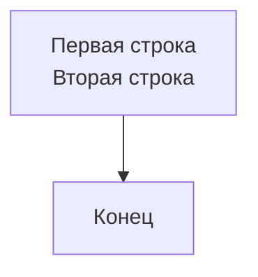
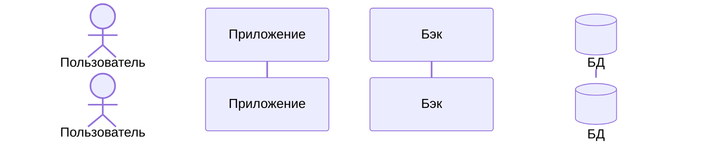
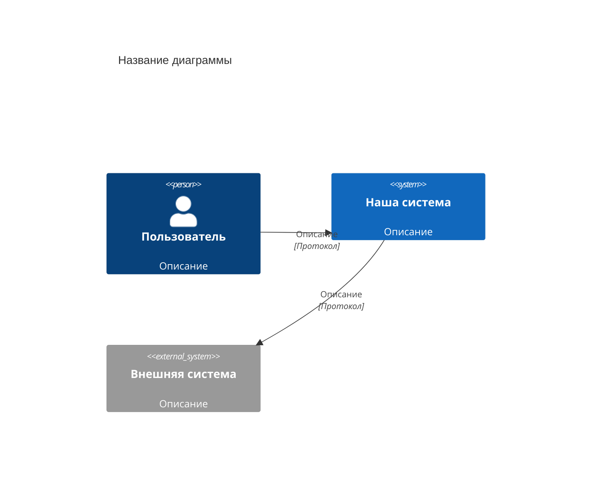
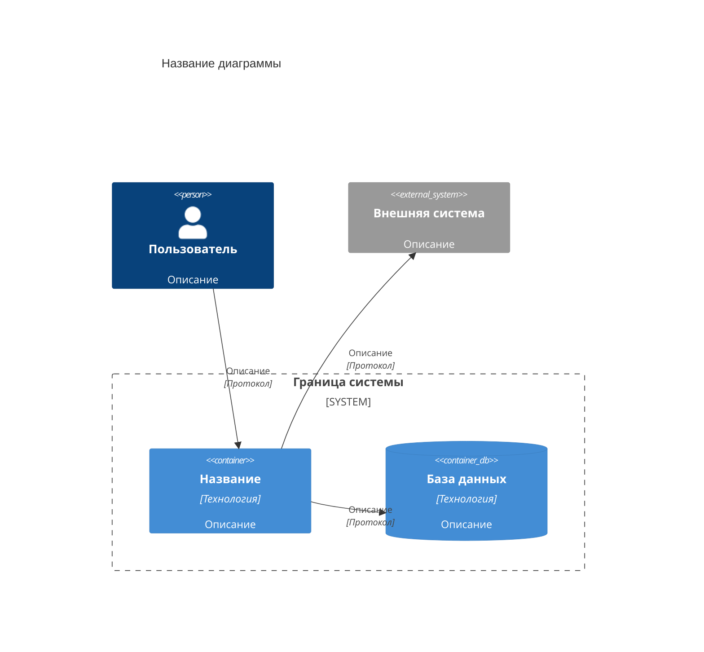
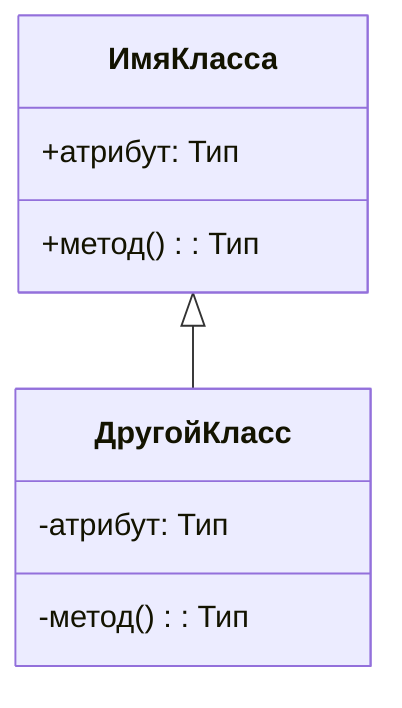
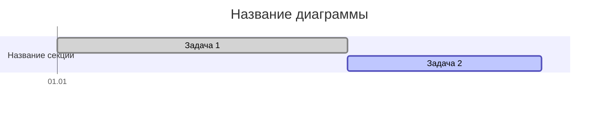
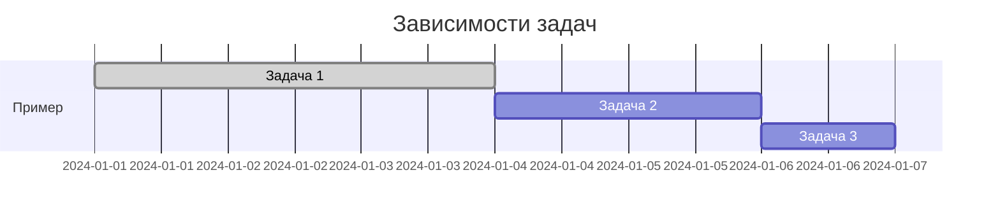

---
tags:
  - mermaid
  - help
  - manual
---

--8<-- "includes/abbreviations.md"

# Mermaid

Mermaid — инструмент для создания диаграмм и визуализаций с помощью текстового описания на основе JavaScript. Такой подход позволяет хранить диаграммы в системе контроля версий, отслеживать изменения и автоматически генерировать их при сборке документации.

Mermaid поддерживает следующие типы диаграмм:

* диаграммы последовательности;

* диаграммы C4;

* диаграммы состояний;

* диаграммы Ганта;

* Git-графы;

* ER-диаграммы.


## Общий синтаксис Mermaid

Код диаграммы заключается в блок с указанием типа диаграммы:

`````markdown
```mermaid
<тип_диаграммы>
```
`````

### Типы диаграмм

| Тип диаграммы | Ключевое слово | Назначение |
| :--- | :--- | :--- |
| Блок-схема | `flowchart` | Визуализация алгоритмов, процессов и workflows |
| Диаграмма последовательности | `sequenceDiagram` | Взаимодействие объектов во времени |
| Диаграмма классов | `classDiagram` | Структура классов, их атрибуты и связи |
| Диаграмма состояний | `stateDiagram` или `stateDiagram-v2` | Состояния объекта и переходы между ними |
| Диаграмма Ганта | `gantt` | Планирование задач и проектов во времени |
| Диаграмма путешествия пользователя | `journey` | Пользовательские сценарии и их оценка |
| Git-граф | `gitGraph` | Визуализация ветвления и коммитов в Git |
| ER-диаграмма | `erDiagram` | Модели данных и связи между сущностями |
| Круговая диаграмма | `pie` | Процентное соотношение частей целого |
| Диаграмма требований | `requirementDiagram` | Требования и их связи |
| Диаграмма C4 | `C4Context`, `C4Container`, `C4Component`, `C4Dynamic` | Архитектурные диаграммы разных уровней |
| Mind-карта | `mindmap` | Иерархическая структура идей и концепций |
| Таймлайн | `timeline` | Хронологическая последовательность событий |
| XY-диаграмма | `xyChart` | Визуализация числовых данных на координатной плоскости |

### Общие команды

Для всех диаграмм доступны общие команды, управляющие отображением:

| Команда | Результат |
| :--- | :--- |
| `title` | Заголовок над диаграммой |
| `%%` | Однострочный комментарий |
| `%%{init: {...}}%%` | Глобальная конфигурация темы |

### Перенос строки

Для переноса строки в надписях используется HTML-тег `<br>`:

`````markdown

`````

### Комментарии

Для пояснений в коде диаграммы используются однострочные комментарии, начинающиеся с `%%`:

```
%% Текст комментария
```
!!! note "Примечание"
    В Mermaid нет многострочных комментариев. Для длинных пояснений используйте несколько однострочных комментариев `%%` подряд.

## Диаграмма последовательности

Диаграмма последовательности показывает взаимодействие между объектами: кто, в каком порядке и каким образом выполняет операции. С её помощью можно описать любой процесс в системе — от пользовательского сценария до внутреннего алгоритма.

### Объявление участников

Участники в диаграмме последовательности —  объекты системы, задействованные в описываемом процессе:

* Пользователь — actor (внешнее действующее лицо).

* База данных — participant с JSON-конфигурацией `@{ "type" : "database" }`.

* Другой объект — participant (любой внутренний компонент системы, например, модуль или сервис).

Участники объявляются в начале диаграммы в формате `тип_участника Имя_участника`:

`````markdown

`````

Порядок объявления участников определяет их расположение на диаграмме слева направо.

??? quote "Результат"
    ```mermaid
    sequenceDiagram
        actor Пользователь
        participant Приложение
        participant Бэк
        participant БД@{ "type" : "database" }
    ```

Для сокращения длинных имён в тексте сценария используется ключевое слово `as`, перед которым указывается псевдоним участника.

=== "Код"

    `````mermaid title="Код Mermaid"
    ```mermaid
    sequenceDiagram
        actor user as Пользователь
        participant БД as База данных
    ```    
    `````    
    
=== "Диаграмма"
 
    ```mermaid
    sequenceDiagram
        actor user as Пользователь
        participant БД as База данных
    ```   

!!! warning "Важно!"
    Не используйте`as` и `@{...}` одновременно. Это вызывает ошибку парсинга. 

### Описание действий

После объявления участников описываются взаимодействия между ними. В большинстве сценариев используются два типа действий:

* Синхронный вызов `->>` (запрос от одного участника к другому).

* Ответ на вызов `-->>` (возврат результата).

Взаимодействия двух участников описываются в формате:

* Вызов: `Участник-1 ->> Участник-2: Описание вызова`.

* Вызов: `Участник-2 -->> Участник-1: Описание ответа`.

=== "Код"

    `````mermaid title="Код Mermaid"
    ```mermaid
    sequenceDiagram
        ticipant Приложение
        participant Бэк
        participant БД@{ "type" : "database" }

        Пользователь ->> Приложение: вызов приложения
        Приложение ->> Бэк: запрос данных
        Бэк ->> БД: SQL-запрос
        БД -->> Бэк: результат
        Бэк -->> Приложение: ответ
        Приложение -->> Пользователь: отображение данных
    ```    
    `````    
    
=== "Диаграмма"
 
    ```mermaid
    sequenceDiagram
        actor Пользователь
        participant Приложение
        participant Бэк
        participant БД@{ "type" : "database" }
       
        Пользователь ->> Приложение: вызов приложения
        Приложение ->> Бэк: запрос данных
        Бэк ->> БД: SQL-запрос
        БД -->> Бэк: результат
        Бэк -->> Приложение: ответ
        Приложение -->> Пользователь: отображение данных    
    ```    

### Альтернативные сценарии

Диаграмма последовательности позволяет отображать не только основной (успешный) сценарий, но и его альтернативные варианты.

Для группировки действий альтернативного сценария используется `alt`:

```
sequenceDiagram
…
alt Альтернативный сценарий
Пользователь -> Приложение: отмена действия
Пользователь <-- Приложение: отображение главного экрана
end
…
```

=== "Код"

    `````mermaid title="Код Mermaid"
    ```mermaid
    sequenceDiagram
        actor Пользователь
        participant Приложение
        participant Бэк
        participant БД@{ "type" : "database" }
       
        Пользователь ->> Приложение: вызов приложения
        Приложение ->> Бэк: запрос данных
        Бэк ->> БД: SQL-запрос
        БД -->> Бэк: результат
        Бэк -->> Приложение: ответ
        Приложение -->> Пользователь: отображение данных

        alt Альтернативный сценарий
        Пользователь ->> Приложение: отмена действия
        Приложение -->> Пользователь: отображение главного экрана
        end
    ```    
    `````    
    
=== "Диаграмма"
 
    ```mermaid
    sequenceDiagram
        actor Пользователь
        participant Приложение
        participant Бэк
        participant БД@{ "type" : "database" }
       
        Пользователь ->> Приложение: вызов приложения
        Приложение ->> Бэк: запрос данных
        Бэк ->> БД: SQL-запрос
        БД -->> Бэк: результат
        Бэк -->> Приложение: ответ
        Приложение -->> Пользователь: отображение данных

        alt Альтернативный сценарий
        Пользователь ->> Приложение: отмена действия
        Приложение -->> Пользователь: отображение главного экрана
        end       
    ```    

Кроме `alt` доступны и другие команды для группировки действий:

* `opt` — действия, которые выполняются только при определённом условии;

* `loop` — повторяющиеся циклические вызовы;

* `par` — параллельные действия;

* `break` — прерывание выполнения.

## Диаграммы C4

C4-модель (Context, Containers, Components, Code) — подход к визуализации архитектуры программных систем с разной степенью детализации. Она включает четыре уровня:

* [Контекстная диаграмма.](#h3#_8)

* [Диаграмма контейнеров.](#h3#_9)

* [Диаграмма компонентов.](#h3#_10)

* [Диаграмма классов.](#h3#_11)

### Контекстная диаграмма

Контекстная диаграмма показывает систему в окружении пользователей и внешних систем.

#### Базовый синтаксис

Код контекстной диаграммы заключается в блок `mermaid` с указанием типа `C4Context`:

`````

`````

Внутри блока перечисляются элементы системы, пользователи и связи между ними.

#### Элементы контекстной диаграммы

| Элемент | Синтаксис | Назначение |
| :--- | :--- | :--- |
| Пользователь | `Person(alias, "Метка", "Описание")` | Внешний пользователь системы |
| Внешний пользователь | `Person_Ext(alias, "Метка", "Описание")` | Пользователь вне системы |
| Система | `System(alias, "Метка", "Описание")` | Описываемая система |
| Внешняя система | `System_Ext(alias, "Метка", "Описание")` | Внешняя система для интеграции |
| Связь | `Rel(от, к, "Описание", "Протокол")` | Взаимодействие между элементами |

#### Пример

=== "Код"

    `````mermaid title="Код Mermaid"
    ```mermaid
    C4Context
        title Контекстная диаграмма интернет-магазина

        Person(покупатель, "Покупатель", "Пользователь, который делает заказ")
        System(магазин, "Интернет-магазин", "Платформа для покупки товаров")
        System_Ext(платежи, "Платёжная система", "Обрабатывает оплату")

        Rel(покупатель, магазин, "Совершает покупки", "HTTPS")
        Rel(магазин, платежи, "Отправляет запрос на оплату", "API")
    ```    
    `````    
    
=== "Диаграмма"
 
    ```mermaid
    C4Context
        title Контекстная диаграмма интернет-магазина

        Person(покупатель, "Покупатель", "Пользователь, который делает заказ")
        System(магазин, "Интернет-магазин", "Платформа для покупки товаров")
        System_Ext(платежи, "Платёжная система", "Обрабатывает оплату")

        Rel(покупатель, магазин, "Совершает покупки", "HTTPS")
        Rel(магазин, платежи, "Отправляет запрос на оплату", "API")
    ``` 

### Диаграмма контейнеров

Диаграмма контейнеров раскрывает систему на уровне крупных технических блоков.

#### Базовый синтаксис

Код диаграммы контейнеров заключается в блок `mermaid` с указанием типа `C4Container`:

`````

`````

Внутри блока перечисляются элементы системы, контейнеры и связи между ними.

#### Элементы диаграммы контейнеров

| Элемент | Синтаксис | Назначение |
| :--- | :--- | :--- |
| Пользователь | `Person(alias, "Метка", "Описание")` | Внешний пользователь системы |
| Контейнер | `Container(alias, "Метка", "Технология", "Описание")` | Крупный компонент (БД, API, приложение) |
| База данных | `ContainerDb(alias, "Метка", "Технология", "Описание")` | Хранилище данных |
| Внешняя система | `System_Ext(alias, "Метка", "Описание")` | Внешняя система для интеграции |
| Граница системы | `System_Boundary(alias, "Метка") { ... }` | Группирует элементы внутри системы |
| Связь | `Rel(от, к, "Описание", "Протокол")` | Взаимодействие между элементами |

#### Пример

=== "Код"

    `````mermaid title="Код Mermaid"
    ```mermaid
    C4Container
        title Диаграмма контейнеров интернет-магазина

        Person(покупатель, "Покупатель", "Пользователь, который делает заказ")

        System_Boundary(магазин, "Интернет-магазин") {
            Container(сайт, "Веб-приложение", "React", "Интерфейс пользователя")
            Container(апи, "API-шлюз", "Spring Boot", "Бизнес-логика")
            ContainerDb(бд, "База данных", "PostgreSQL", "Хранение данных")
        }

        System_Ext(платежи, "Платёжная система", "Обрабатывает оплату")

        Rel(покупатель, сайт, "Использует", "HTTPS")
        Rel(сайт, апи, "Отправляет запросы", "REST")
        Rel(апи, бд, "Читает/пишет", "JDBC")
        Rel(апи, платежи, "Отправляет запрос на оплату", "API")
    ```    
    `````    
    
=== "Диаграмма"
 
    ```mermaid
    C4Container
        title Диаграмма контейнеров интернет-магазина

        Person(покупатель, "Покупатель", "Пользователь, который делает заказ")

        System_Boundary(магазин, "Интернет-магазин") {
            Container(сайт, "Веб-приложение", "React", "Интерфейс пользователя")
            Container(апи, "API-шлюз", "Spring Boot", "Бизнес-логика")
            ContainerDb(бд, "База данных", "PostgreSQL", "Хранение данных")
        }

        System_Ext(платежи, "Платёжная система", "Обрабатывает оплату")

        Rel(покупатель, сайт, "Использует", "HTTPS")
        Rel(сайт, апи, "Отправляет запросы", "REST")
        Rel(апи, бд, "Читает/пишет", "JDBC")
        Rel(апи, платежи, "Отправляет запрос на оплату", "API")
    ```    
    
### Диаграмма компонентов

Диаграмма компонентов показывает внутреннее устройство конкретного контейнера.

#### Базовый синтаксис

Код диаграммы компонентов заключается в блок `mermaid` с указанием типа `C4Component`:

`````
```mermaid
C4Component
    title Название диаграммы

    Container_Boundary(название, "Граница контейнера") {
        Component(компонент, "Название", "Технология", "Описание")
        ComponentDb(бд, "База данных", "Технология", "Описание")
    }

    System_Ext(внешняя, "Внешняя система", "Описание")

    Rel(компонент, другой, "Описание")
    Rel(компонент, бд, "Описание")
    Rel(компонент, внешняя, "Описание", "Протокол")
```
`````

Внутри блока перечисляются экомпоненты, их зависимости и взаимодействия.

#### Элементы диаграммы компонентов

| Элемент | Синтаксис | Назначение |
| :--- | :--- | :--- |
| Компонент | `Component(alias, "Метка", "Технология", "Описание")` | Модуль внутри контейнера |
| Компонент БД | `ComponentDb(alias, "Метка", "Технология", "Описание")` | Компонент для работы с данными |
| Граница контейнера | `Container_Boundary(alias, "Метка") { ... }` | Группирует компоненты внутри контейнера |
| Внешняя система | `System_Ext(alias, "Метка", "Описание")` | Внешняя система для интеграции |
| Связь | `Rel(от, к, "Описание")` | Взаимодействие между компонентами |
| Связь с протоколом | `Rel(от, к, "Описание", "Протокол")` | Взаимодействие с указанием протокола |

#### Пример

=== "Код"

    `````mermaid title="Код Mermaid"
    ```mermaid
    C4Component
        title Диаграмма компонентов интернет-магазина

        Container_Boundary(апи, "API-шлюз") {
            Component(контроллер, "Контроллер заказов", "Spring MVC", "Принимает запросы")
            Component(сервис, "Сервис заказов", "Spring Bean", "Бизнес-логика")
            ComponentDb(репозиторий, "Репозиторий заказов", "Spring Data", "Доступ к данным")
        }

        System_Ext(платежи, "Платёжная система", "Обрабатывает оплату")

        Rel(контроллер, сервис, "Вызывает")
        Rel(сервис, репозиторий, "Использует")
        Rel(сервис, платежи, "Отправляет запрос на оплату", "API")
    ```    
    `````      

=== "Диаграмма"
 
    ```mermaid
    C4Component
    title Диаграмма компонентов интернет-магазина

    Container_Boundary(апи, "API-шлюз") {
        Component(контроллер, "Контроллер заказов", "Spring MVC", "Принимает запросы")
        Component(сервис, "Сервис заказов", "Spring Bean", "Бизнес-логика")
        ComponentDb(репозиторий, "Репозиторий заказов", "Spring Data", "Доступ к данным")
    }

    System_Ext(платежи, "Платёжная система", "Обрабатывает оплату")

    Rel(контроллер, сервис, "Вызывает")
    Rel(сервис, репозиторий, "Использует")
    Rel(сервис, платежи, "Отправляет запрос на оплату", "API")
    ```   
    
### Диаграмма классов

Диаграмма классов детализирует реализацию компонентов на уровне кода (необязательный уровень).

#### Базовый синтаксис

Код диаграммы классов заключается в блок `mermaid` с указанием типа `classDiagram`:

`````

`````

Внутри блока перечисляются классы, их атрибуты и методы, а также связи между ними.

#### Модификаторы доступа

Модификаторы доступа в диаграммах классов показывают, какая часть системы может обращаться к определённым полям и методам. Это помогает понимать архитектуру и границы ответственности классов.

| Символ | Значение | Описание |
| :---: | :--- | :--- |
| `+` | public | Доступен из любого места |
| `-` | private | Доступен только внутри класса |
| `#` | protected | Доступен внутри класса и его наследников |
| `~` | package | Доступен внутри пакета |

#### Типы классов

В диаграммах классов Mermaid поддерживаются четыре основных типа: обычный класс, интерфейс, абстрактный класс и перечисление. Они различаются по назначению и отображаются с помощью стереотипов  `<< >>`.

| Тип | Синтаксис | Описание |
| :--- | :--- | :--- |
| Класс | `class Имя { ... }` | Описывает класс с полями и методами |
| Интерфейс | `class Имя <<interface>> { ... }` | Описывает интерфейс |
| Абстрактный класс | `class Имя <<abstract>> { ... }` | Описывает абстрактный класс |
| Перечисление | `class Имя <<enumeration>> { ... }` | Описывает перечисление |

#### Связи между классами

Связи показывают, как классы взаимодействуют друг с другом. В Mermaid используются стандартные UML-отношения: наследование, реализация интерфейса, ассоциация, зависимость, композиция и агрегация. 

| Связь | Синтаксис | Описание |
| :--- | :--- | :--- |
| Наследование | `Child <|-- Parent` | Класс наследует другой класс |
| Реализация интерфейса | `Class <|.. Interface` | Класс реализует интерфейс |
| Ассоциация | `Class --> Other` | Прямая связь между классами |
| Зависимость | `Class ..> Other` | Класс использует другой класс |
| Композиция | `Class *-- Part` | Часть не может существовать без целого |
| Агрегация | `Class o-- Part` | Часть может существовать отдельно |

#### Пример

=== "Код"

    `````go title="md-файл"
    ```mermaid
    classDiagram
        class IOrderController {
            <<interface>>
            +createOrder(request: OrderRequest): OrderResponse
            +getOrder(id: String): OrderDetails
            +cancelOrder(id: String): void
        }

        class OrderController {
            -orderService: IOrderService
            -validator: IOrderValidator
            +createOrder(request: OrderRequest): OrderResponse
            +getOrder(id: String): OrderDetails
            +cancelOrder(id: String): void
        }

        class IOrderService {
            <<interface>>
            +processOrder(request: OrderRequest): Order
            +getOrder(id: String): Order
            +cancelOrder(id: String): void
        }

        class OrderService {
            -orderRepository: IOrderRepository
            -pricingCalculator: IPricingCalculator
            +processOrder(request: OrderRequest): Order
            +getOrder(id: String): Order
            +cancelOrder(id: String): void
        }

        class IOrderRepository {
            <<interface>>
            +save(order: Order): Order
            +findById(id: String): Order
            +updateStatus(id: String, status: Status): void
        }

        class OrderRepository {
            -jdbcTemplate: JdbcTemplate
            +save(order: Order): Order
            +findById(id: String): Order
            +updateStatus(id: String, status: Status): void
        }

        class Order {
            -id: String
            -customerId: String
            -items: List~OrderItem~
            -total: BigDecimal
            -status: Status
            +calculateTotal(): BigDecimal
            +addItem(item: OrderItem): void
        }

        class Status {
            <<enumeration>>
            PENDING
            CONFIRMED
            SHIPPED
            CANCELLED
        }

        IOrderController <|-- OrderController
        IOrderService <|-- OrderService
        IOrderRepository <|-- OrderRepository

        OrderController --> IOrderService : uses
        OrderService --> IOrderRepository : uses
        OrderService ..> Order : creates
        OrderRepository ..> Order : manages
        Order --> Status : uses
    ```    
    `````      

=== "Диаграмма"
 
       

## Диаграмма Ганта

Диаграмма Ганта (Gantt chart) используется для визуализации расписания задач, их длительности и зависимостей между ними. С её помощью можно планировать этапы работы, отслеживать прогресс и управлять сроками в проекте.

### Базовый синтаксис

Код диаграммы Ганта заключается в блок `mermaid` с указанием типа `gantt`:

`````

`````
Внутри блока задаются параметры отображения и перечисляются задачи, сгруппированные по секциям.

### Элементы диаграммы

| Команда| Синтаксис | Описание |
| :--- | :--- | :--- |
| dateFormat | `dateFormat YYYY-MM-DD` / `dateFormat DD.MM.YYYY` | Формат всех дат в диаграмме. Без него диаграмма не будет построена |
| section | `section Название` | Группа задач. Секции помогают логически разделить этапы проекта |
| axisFormat | `axisFormat %d.%m` / `axisFormat %d.%m.%Y` / `axisFormat %Y-%m-%d` / `axisFormat %m/%d` / `axisFormat %H:%M`| Формат отображения дат на горизонтальной оси. По умолчанию используется `%Y-%m-%d` |
| tickInterval | `tickInterval 7day` | Интервал между делениями на оси. Можно указывать в днях, неделях или месяцах |

### Статусы задач

Каждая задача может иметь один из четырёх статусов, которые определяют её цвет на диаграмме.

| Статус | Синтаксис | Цвет | Описание |
| :--- | :--- | :--- | :--- |
| Выполнена | `:done, id, дата, длительность` | Зелёный | Для завершённых задач |
| В работе | `:active, id, дата, длительность` | Синий | Для текущих задач, которые выполняются сейчас |
| Критическая | `:crit, id, дата, длительность` | Красный | Для задач с жёсткими дедлайнами, срыв которых критичен |
| Запланирована | `:id, дата, длительность` | Серый | Для задач, которые ещё не начались (статус по умолчанию) |

!!! warning "Важно!"
    Критические задачи используйте для ключевых этапов, срыв которых влияет на весь проект.

### Создание зависимостей между задачами

В реальных проектах задачи редко выполняются изолированно. Одна задача часто не может начаться раньше, чем завершится другая. Для этого используются зависимости:

* `after id` – задача начинается сразу после завершения задачи с указанным `id`;

* `after id, 2d` – задача начинается через 2 дня после завершения задачи с указанным `id`.

!!! warning "Важно!"
    Убедитесь, что задача с указанным `id` существует и завершена (или активна)



### Пример

Ниже показана диаграмма Ганта для гипотетического проекта разработки. Она включает этапы планирования, разработки и тестирования, а также демонстрирует использование разных статусов задач.

=== "Пример"

    ```mermaid title="Код Mermaid"
    ```mermaid
    gantt
        title Проект разработки (2026)
        dateFormat  YYYY-MM-DD
        axisFormat %d.%m

        section Планирование
        Сбор и анализ требований          :done, req, 2026-01-10, 7d
        Оценка и формирование плана       :done, plan, 2026-01-17, 5d
        Согласование с заказчиком         :done, sign, after plan, 3d

        section Дизайн
        UI/UX-прототипирование            :done, ux, 2026-01-25, 10d
        Дизайн интерфейса (web)           :done, design-web, after ux, 8d
        Дизайн интерфейса (mobile)        :done, design-mob, after ux, 10d
        Создание дизайн-системы           :done, design-sys, 2026-02-01, 12d

        section Разработка
        Настройка окружения и CI/CD       :done, infra, 2026-02-01, 5d
        Проектирование БД                 :done, db-design, after infra, 7d
        Разработка бэкенда (ядро)         :active, backend-core, after db-design, 20d
        Разработка бэкенда (модули)       :backend-modules, after backend-core, 20d
        Интеграция с внешними API         :api, after backend-modules, 10d
        Разработка фронтенда (web)        :frontend-web, after design-web, 25d
        Разработка фронтенда (mobile)     :frontend-mob, after design-mob, 25d
        Сборка и развёртывание            :devops, after api, 10d

        section Тестирование
        Модульное тестирование            :crit, test-unit, 2026-04-15, 10d
        Интеграционное тестирование       :crit, test-int, 2026-05-01, 12d
        UI/UX-тестирование                :crit, test-ui, 2026-05-10, 10d
        Нагрузочное тестирование          :crit, test-load, 2026-05-15, 8d
        Исправление ошибок и доработки    :fix, 2026-05-20, 15d

        section Релиз
        Подготовка документации           :done, docs, 2026-05-01, 14d
        Релиз-кандидат                    :crit, rc, 2026-06-01, 5d
        Финальное тестирование            :crit, uat, after rc, 7d
        Выпуск в production               :release, after uat, 2d
    ```

=== "Диаграмма"

    ```mermaid
    gantt
        title Проект разработки (2026)
        dateFormat  YYYY-MM-DD
        axisFormat %d.%m

        section Планирование
        Сбор и анализ требований          :done, req, 2026-01-10, 7d
        Оценка и формирование плана       :done, plan, 2026-01-17, 5d
        Согласование с заказчиком         :done, sign, after plan, 3d

        section Дизайн
        UI/UX-прототипирование            :done, ux, 2026-01-25, 10d
        Дизайн интерфейса (web)           :done, design-web, after ux, 8d
        Дизайн интерфейса (mobile)        :done, design-mob, after ux, 10d
        Создание дизайн-системы           :done, design-sys, 2026-02-01, 12d

        section Разработка
        Настройка окружения и CI/CD       :done, infra, 2026-02-01, 5d
        Проектирование БД                 :done, db-design, after infra, 7d
        Разработка бэкенда (ядро)         :active, backend-core, after db-design, 20d
        Разработка бэкенда (модули)       :backend-modules, after backend-core, 20d
        Интеграция с внешними API         :api, after backend-modules, 10d
        Разработка фронтенда (web)        :frontend-web, after design-web, 25d
        Разработка фронтенда (mobile)     :frontend-mob, after design-mob, 25d
        Сборка и развёртывание            :devops, after api, 10d

        section Тестирование
        Модульное тестирование            :crit, test-unit, 2026-04-15, 10d
        Интеграционное тестирование       :crit, test-int, 2026-05-01, 12d
        UI/UX-тестирование                :crit, test-ui, 2026-05-10, 10d
        Нагрузочное тестирование          :crit, test-load, 2026-05-15, 8d
        Исправление ошибок и доработки    :fix, 2026-05-20, 15d

        section Релиз
        Подготовка документации           :done, docs, 2026-05-01, 14d
        Релиз-кандидат                    :crit, rc, 2026-06-01, 5d
        Финальное тестирование            :crit, uat, after rc, 7d
        Выпуск в production               :release, after uat, 2d
    ```    

## Git-граф

Git-граф позволяет визуализировать историю коммитов, ветвление и слияния в Git-репозитории.

### Базовый синтаксис

Код Git-графа заключается в блок `mermaid` с указанием типа `gitGraph`:

`````

`````
Внутри блока перечисляются команды, описывающие коммиты, ветки и слияния.

### Основные команды

| Команда| Синтаксис | Описание |
| :--- | :--- | :--- |
| commit | `commit` | Добавляет коммит в текущую ветку |
| branch | `branch [имя]` | Создаёт новую ветку от текущего коммита |
| checkout | `checkout [имя]` | Переключается на указанную ветку |
| merge | `merge [ветка]` | Сливает указанную ветку в текущую |

!!! warning "Важно!"
    После команды `checkout` все следующие коммиты попадают в выбранную ветку

### Параметры Git-графа

| Параметр | Команда | Синтаксис | Описание |
| :--- | :---: | :--- | :--- |
| `id` | commit, merge | `commit id: "Текст"`<br>`merge develop id: "Текст"` | Подпись коммита или коммита слияния |
| `tag` | commit, merge | `commit tag: "v1.0.0"`<br>`merge develop tag: "v1.1.0"` | Тег для маркировки коммита или слияния |
| `type: NORMAL` | commit | `commit type: NORMAL` | Обычный коммит (зелёный, по умолчанию) |
| `type: HIGHLIGHT` | commit | `commit type: HIGHLIGHT` | Выделенный коммит (синий) |
| `type: REVERSE` | commit | `commit type: REVERSE` | Коммит отмены изменений (красный) |

### Пример

=== "Код"

    ```mermaid title="Код Mermaid"
    ```mermaid
    gitGraph
        commit id: "Создала проекта"
        commit id: "Добавила плагины"
    
        branch ci-cd
        checkout ci-cd
        commit id: "Добавила workflow"
        checkout main
        merge ci-cd id: "Слияние ветки ci-cd" tag: "v1.0.0"

        branch api-docs
        checkout api-docs
        commit id: "Добавила Swagger API"
        сommit id: "Добавила Redoc API"
        checkout main
        merge api-docs id: "Слияние ветки api-docs" tag: "v1.0.1"

        branch stylesheets
        checkout stylesheets
        commit id: "Изменила оформление страницы"
        commit id: "Изменила стили шрифтов"
        checkout main
        merge stylesheets id: "Слияние ветки stylesheets" tag: "v1.0.2"
    
        commit id: "Добавила ресурсный файл"
    ```    
    
=== "Диаграмма"
 
    ```mermaid
    gitGraph
        commit id: "Создала проекта"
        commit id: "Добавила плагины"
    
        branch ci-cd
        checkout ci-cd
        commit id: "Добавила workflow"
        checkout main
        merge ci-cd id: "Слияние ветки ci-cd" tag: "v1.0.0"

        branch api-docs
        checkout api-docs
        commit id: "Добавила Swagger API"
        commit id: "Добавила Redoc API"
        checkout main
        merge api-docs id: "Слияние ветки api-docs" tag: "v1.0.1"

        branch stylesheets
        checkout stylesheets
        commit id: "Изменила оформление страницы"
        commit id: "Изменила стили шрифтов"
        checkout main
        merge stylesheets id: "Слияние ветки stylesheets" tag: "v1.0.2"
    
        commit id: "Добавила ресурсный файл"
    ```    

## Генерация Mermaid в MkDocs Materials

### Встроенная поддержка Material 

Mermaid интегрируется в MkDocs Materials без дополнительных настроек. Установка плагинов не требуется.

1. Добавьте в mkdocs.yml настройку для обработки блоков Mermaid:
```yaml title="mkdocs.yml"
markdown_extensions:
  - pymdownx.superfences:
      custom_fences:
        - name: mermaid
          class: mermaid
          format: !!python/name:pymdownx.superfences.fence_mermaid_format
```
2. Добавьте в md-файл код Mermaid-диаграммы, в блоке кода диаграммы укажите `mermaid`:
`````
```mermaid
<тип_диаграммы>
```
`````

--8<-- "includes/abbreviations.md"

**Результат**: при сборке проекта диаграмма автоматически отобразится на странице.

### Установка плагина

Используйте плагин `mkdocs-mermaid2-plugin`, если встроенная поддержка не работает или нужна более стабильная версия Mermaid.

1. Установите плагин `mkdocs-mermaid2-plugin`:
```
pip install mkdocs-mermaid2-plugin
```
2. Подключите плагин в `mkdocs.yml`{: title="конфигурационный файл проекта"}:
```yaml title="mkdocs.yml"
plugins:
  - search
  - mermaid2

markdown_extensions:
  - pymdownx.superfences:
      custom_fences:
        - name: mermaid
          class: mermaid
          format: !!python/name:mermaid2.fence_mermaid
```
3. Добавьте в md-файл код Mermaid-диаграммы, в блоке кода диаграммы укажите `mermaid`:
`````
```mermaid
<тип_диаграммы>
```
`````
**Результат**: при сборке проекта диаграмма автоматически отобразится на странице.

## Полезные ссылки

* [Официальный сайт Mermaid](https://mermaid.js.org/intro/) — документация, руководства и описание всех типов диаграмм.

* [Mermaid Live Editor](https://mermaid.live/edit#pako:eNpVkU9vgzAMxb9K5NMm0QpaCJDDpJVuvXTaDj0NeoiKIWglQSGo64DvvkCl_fHJ9nu_54N7OKkcgUFxVpeT4NqQwzaTxNZjmghdtabm7ZEsFg_DDg2plcTrQDZ3O0VaoZqmkuX9zb-ZTCTp95MNiRGV_BhvUjLzrxIHsk33vDGqOf5VDhc1kKe0ehM2_r8iNFrqOS04K_jixDVJuD6CA6WucrC7c4sO1KhrPs3QT3QGRmCNGTDb5ljw7mwyyORouYbLd6VqYEZ3ltSqK8VPTtfk3OC24qXmvxaUOepEddIAWwfenAGsh89ppEs_omvP9cJwFUTUd-AKLHCXLl0FrufSgMZR7I0OfM1X3WUUBq4tL6Ir6vth7ADmlVH65faI-R_jN-a8fOY) — онлайн-песочница для создания, редактирования и экспорта диаграмм.

* [Плагин `mkdocs-mermaid2-plugin`](https://pypi.org/project/mkdocs-mermaid2-plugin/0.5.1/) — плагин для интеграции Mermaid в MkDocs. Позволяет использовать диаграммы в документации без дополнительных настроек.
