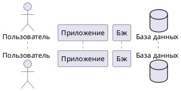
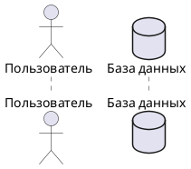
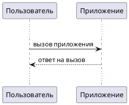
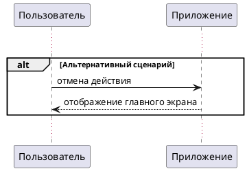

---
tags:
  - plantuml
  - help
  - manual
---

--8<-- "includes/abbreviations.md"

# PlantUML

UML — язык для визуализации, проектирования и документирования программных систем на основе абстрактных моделей.

PlantUML — инструмент для создания диаграмм и схем с помощью текстового описания. Такой подход позволяет хранить их в системе контроля версий, отслеживать изменения и автоматизировать генерацию.

PlantUML позволяет создавать диаграммы следующих типов:

* диаграммы последовательности;

* диаграммы C4;

* диаграммы активностей;

* диаграммы прецедентов;

* диаграммы состояний

## Общий синтаксис PlantUML

Независимо от типа диаграммы, её код заключается в теги `@startuml` и `@enduml`:

```
@startuml
@enduml
```

### Общие команды

Для всех диаграмм доступны общие команды, управляющие отображением:

| Команда | Результат |
| :--- | :--- |
| title | Заголовок над диаграммой |
| caption | Подпись под диаграммой |
| legend | Легенда с пояснениями |
| header / footer | Колонтитулы сверху и снизу |
| scale | Масштабирование изображения |

### Перенос строки

Для переноса строки в надписях используется `%n()`.

!!! note "Примечание"
    В текущих версиях PlantUML также работает `\n`, но он устаревает. Для новых диаграмм рекомендуется использовать `%n()`.

### Комментарии

Для пояснений в коде диаграммы используются комментарии:

* Однострочные — начинаются с `'`.

* Многострочные — выделяются `/'` и `'/`.

```
@startuml
' Однострочный комментарий
/'
  Многострочный
  комментарий
'/
@enduml
```

## Диаграмма последовательности

Диаграмма последовательности показывает взаимодействие между объектами: кто, в каком порядке и каким образом выполняет операции. С её помощью можно описать любой процесс в системе — от пользовательского сценария до внутреннего алгоритма.

### Объявление участников

Участники в диаграмме последовательности — объекты системы, задействованные в описываемом процессе:

* Пользователь — actor (внешнее действующее лицо).

* База данных — database (хранилище данных).

* Другой объект — participant (любой внутренний компонент системы, например, модуль или сервис).

Участники объявляются в начале диаграммы в формате `тип_участника Имя_участника`:



Порядок объявления участников определяет их расположение на диаграмме слева направо.

??? quote "Результат"
    ```puml
    @startuml
    actor Пользователь
    participant Приложение
    participant Бэк
    database "База данных"
    @enduml
    ```

!!! note "Примечание"
    Если имя участника содержит пробелы, оно заключается в кавычки.

Для сокращения длинных имён в тексте сценария используется ключевое слово `as`, после которого указывается псевдоним участника.



### Описание действий

После объявления участников описываются взаимодействия между ними. В большинстве сценариев используются два типа действий:

* Синхронный вызов `->` (запрос от одного участника к другому).

* Ответ на вызов `<--` (возврат результата).

Взаимодействия двух участников описываются в формате:

* Вызов: `Участник-1 -> Участник-2: Описание вызова`.

* Ответ: `Участник-1 <-- Участник-2: Описание ответа`.



??? quote "Результат"
    ```puml
    @startuml
    actor Пользователь
    participant Приложение
    participant Бэк
    database "База данных"

    Пользователь -> Приложение: вызов приложения
    Пользователь <-- Приложение: ответ на вызов
    @enduml
    ```

### Альтернативные сценарии

Диаграмма последовательности позволяет отображать не только основной (успешный) сценарий, но и его альтернативные варианты.

Для группировки действий альтернативного сценария используется `alt`:


??? quote "Результат"
    ```puml
    @startuml
    actor Пользователь
    participant Приложение
    participant Бэк
    database "База данных"

    Пользователь -> Приложение: вызов приложения
    Пользователь <-- Приложение: ответ на вызов

    alt Альтернативный сценарий
    Пользователь -> Приложение: отмена действия
    Пользователь <-- Приложение: отображение главного экрана
    end alt
    @enduml
    ```

Кроме `alt` доступны и другие команды для группировки действий:

* `opt` — действия, которые выполняются только при определённом условии;

* `loop` — повторяющиеся циклические вызовы;

* `group` — действия, объединённые по смыслу.

## Диаграммы C4

C4-модель (Context, Containers, Components, Code) — это подход к визуализации архитектуры программных систем с разной степенью детализации. Она включает четыре уровня:

* [Контекстная диаграмма.](#_8)

* [Диаграмма контейнеров.](#_9)

* [Диаграмма компонентов.](#_10)

* [Диаграмма классов.](#_11)

### Подключение библиотеки PlantUML

Для работы с C4-диаграммами в начале файла подключается нужный компонет из стандартной библиотеки PlantUML:

* **Контекстная диаграмма** – `!include <C4/C4_Context>`

* **Диаграмма контейнеров** — `!include <C4/C4_Container>`

* **Диаграмма компонентов** — `!include <C4/C4_Component>`

```plantuml title="Пример" 
@startuml
!include <C4/C4_Container>
…
@enduml
```

!!! note "Примечание"
    Для диаграммы классов отдельная библиотека не требуется.

### Общие команды для C4-диаграмм

Для всех C4-диаграмм доступны общие команды, управляющие отображением:

| Команда | Результат |
| :--- | :--- |
| `LAYOUT_TOP_DOWN()` | Расположение элементов сверху вниз |
| `LAYOUT_LEFT_RIGHT()` | Расположение элементов слева направо |
| `LAYOUT_LANDSCAPE()` | Альбомная ориентация диаграммы |
| `LAYOUT_WITH_LEGEND()` | Легенда диаграммы |
| `LAYOUT_AS_SKETCH()` | Стиль «от руки» |
| `$BOUNDARY_BORDER_STYLE = "solid"` | Сплошная граница |
| `$BOUNDARY_BORDER_STYLE = "bold"` | Жирная граница |
| `$BOUNDARY_BORDER_STYLE = "dotted"` | Точечная граница |

### Контекстная диаграмма

Контекстная диаграмма показывает систему в окружении пользователей и внешних систем.

!!! warning "Важно!"
    Для построения контекстной диаграммы **требуется** [подключить C4-библиотеку.](#plantuml_2)

#### Базовый синтаксис

Код контекстной диаграммы заключается в блок `@startuml` / `@enduml` с подключением библиотеки `C4_Context`:

`````
@startuml
!include <C4/C4_Context>

title Название диаграммы

Person(пользователь, "Пользователь", "Описание")
System(система, "Наша система", "Описание")
System_Ext(внешняя, "Внешняя система", "Описание")

Rel(пользователь, система, "Описание", "Протокол")
Rel(система, внешняя, "Описание", "Протокол")
@enduml
`````

Внутри блока перечисляются элементы системы, контейнеры и связи между ними.

#### Элементы контекстной диаграммы

| Элемент | Синтаксис | Назначение |
| :--- | :--- | :--- |
| Пользователь | `Person(alias, "Метка", "Описание")` | Внешний пользователь системы |
| Внешний пользователь | `Person_Ext(alias, "Метка", "Описание")` | Пользователь вне системы |
| Система | `System(alias, "Метка", "Описание")` | Описываемая система |
| Внешняя система | `System_Ext(alias, "Метка", "Описание")` | Внешняя система для интеграции |

#### Пример

=== "Код"

    `````puml title="Код PlantUML"
    @startuml
    !include <C4/C4_Context>

    title Контекстная диаграмма интернет-магазина

    Person(покупатель, "Покупатель", "Пользователь, который делает заказ")
    System(магазин, "Интернет-магазин", "Платформа для покупки товаров")
    System_Ext(платежи, "Платёжная система", "Обрабатывает оплату")

    Rel(покупатель, магазин, "Совершает покупки", "HTTPS")
    Rel(магазин, платежи, "Отправляет запрос на оплату", "API")
    @enduml
    `````    
    
=== "Диаграмма"
 
    ```puml
    @startuml
    !include <C4/C4_Context>

    title Контекстная диаграмма интернет-магазина

    Person(покупатель, "Покупатель", "Пользователь, который делает заказ")
    System(магазин, "Интернет-магазин", "Платформа для покупки товаров")
    System_Ext(платежи, "Платёжная система", "Обрабатывает оплату")

    Rel(покупатель, магазин, "Совершает покупки", "HTTPS")
    Rel(магазин, платежи, "Отправляет запрос на оплату", "API")
    @enduml
    ```   

### Диаграмма контейнеров

Диаграмма контейнеров раскрывает систему на уровне крупных технических блоков.

!!! warning "Важно!"
    Для построения диаграммы контейнеров **требуется** [подключить C4-библиотеку.](#plantuml_2)

#### Базовый синтаксис

Код диаграммы контейнеров заключается в блок `@startuml` / `@enduml` с подключением библиотеки `C4_Container`:

`````
@startuml
!include <C4/C4_Container>

title Название диаграммы

Person(пользователь, "Пользователь", "Описание")

System_Boundary(название, "Граница системы") {
    Container(контейнер, "Название", "Технология", "Описание")
    ContainerDb(бд, "База данных", "Технология", "Описание")
}

System_Ext(внешняя, "Внешняя система", "Описание")

Rel(пользователь, контейнер, "Описание", "Протокол")
Rel(контейнер, бд, "Описание", "Протокол")
Rel(контейнер, внешняя, "Описание", "Протокол")
@enduml
`````

Внутри блока перечисляются элементы системы, контейнеры и связи между ними.

#### Элементы диаграммы контейнеров

| Элемент | Синтаксис | Назначение |
| :--- | :--- | :--- |
| Пользователь | `Person(alias, "Метка", "Описание")` | Внешний пользователь системы |
| Контейнер | `Container(alias, "Метка", "Технология", "Описание")` | Крупный компонент (БД, API, приложение) |
| База данных | `ContainerDb(alias, "Метка", "Технология", "Описание")` | Хранилище данных |
| Внешняя система | `System_Ext(alias, "Метка", "Описание")` | Внешняя система для интеграции |
| Граница системы | `System_Boundary(alias, "Метка") { ... }` | Группирует элементы внутри системы |

#### Пример

=== "Код"

    `````puml title="Код PlantUML"
    @startuml
    !include <C4/C4_Container>

    title Диаграмма контейнеров интернет-магазина

    Person(покупатель, "Покупатель")

    System_Boundary(магазин, "Интернет-магазин") {
        Container(сайт, "Веб-приложение", "React", "Интерфейс пользователя")
        Container(апи, "API-шлюз", "Spring Boot", "Бизнес-логика")
        ContainerDb(бд, "База данных", "PostgreSQL", "Хранение данных")
    }

    System_Ext(платежи, "Платёжная система", "Обрабатывает оплату")

    Rel(покупатель, сайт, "Использует", "HTTPS")
    Rel(сайт, апи, "Отправляет запросы", "REST")
    Rel(апи, бд, "Читает/пишет", "JDBC")
    Rel(апи, платежи, "Отправляет запрос на оплату", "API")
    @enduml
    `````    
    
=== "Диаграмма"
 
    ```puml
    @startuml
    !include <C4/C4_Container>

    title Диаграмма контейнеров интернет-магазина

    Person(покупатель, "Покупатель")

    System_Boundary(магазин, "Интернет-магазин") {
        Container(сайт, "Веб-приложение", "React", "Интерфейс пользователя")
        Container(апи, "API-шлюз", "Spring Boot", "Бизнес-логика")
        ContainerDb(бд, "База данных", "PostgreSQL", "Хранение данных")
    }

    System_Ext(платежи, "Платёжная система", "Обрабатывает оплату")

    Rel(покупатель, сайт, "Использует", "HTTPS")
    Rel(сайт, апи, "Отправляет запросы", "REST")
    Rel(апи, бд, "Читает/пишет", "JDBC")
    Rel(апи, платежи, "Отправляет запрос на оплату", "API")
    @enduml
    ```   

### Диаграмма компонентов

Диаграмма компонентов показывает внутреннее устройство конкретного контейнера.

!!! warning "Важно!"
    Для построения диаграммы компонентов **требуется** [подключить C4-библиотеку.](#plantuml_2)

#### Базовый синтаксис

Код диаграммы компонентов заключается в блок `@startuml` / `@enduml` с подключением библиотеки `C4_Component`:

`````
@startuml
!include <C4/C4_Component>

title Название диаграммы

Container_Boundary(контейнер, "Граница контейнера") {
    Component(компонент, "Название", "Технология", "Описание")
    ComponentDb(бд, "База данных", "Технология", "Описание")
}

System_Ext(внешняя, "Внешняя система", "Описание")

Rel(компонент, другой, "Описание")
Rel(компонент, бд, "Описание")
Rel(компонент, внешняя, "Описание", "Протокол")
@enduml
`````

Внутри блока перечисляются компоненты, их зависимости и взаимодействия.

#### Элементы диаграммы компонентов

| Элемент | Синтаксис | Назначение |
| :--- | :--- | :--- |
| Компонент | `Component(alias, "Метка", "Технология", "Описание")` | Модуль внутри контейнера |
| Компонент БД | `ComponentDb(alias, "Метка", "Технология", "Описание")` | Компонент для работы с данными |
| Граница контейнера | `Container_Boundary(alias, "Метка") { ... }` | Группирует компоненты внутри контейнера |
| Внешняя система | `System_Ext(alias, "Метка", "Описание")` | Внешняя система для интеграции |
| Связь | `Rel(от, к, "Описание")` | Взаимодействие между компонентами |
| Связь с протоколом | `Rel(от, к, "Описание", "Протокол")` | Взаимодействие с указанием протокола |

#### Пример

=== "Код"

    `````puml title="Код PlantUML"
    @startuml
    !include <C4/C4_Component>

    title Диаграмма компонентов интернет-магазина

    Container_Boundary(апи, "API-шлюз") {
        Component(контроллер, "Контроллер заказов", "Spring MVC", "Принимает запросы")
        Component(сервис, "Сервис заказов", "Spring Bean", "Бизнес-логика")
        ComponentDb(репозиторий, "Репозиторий заказов", "Spring Data", "Доступ к данным")
    }

    System_Ext(платежи, "Платёжная система", "Обрабатывает оплату")

    Rel(контроллер, сервис, "Вызывает")
    Rel(сервис, репозиторий, "Использует")
    Rel(сервис, платежи, "Отправляет запрос на оплату", "API")
    @enduml
    `````    
    
=== "Диаграмма"
 
    ```puml
    @startuml
    !include <C4/C4_Component>

    title Диаграмма компонентов интернет-магазина

    Container_Boundary(апи, "API-шлюз") {
        Component(контроллер, "Контроллер заказов", "Spring MVC", "Принимает запросы")
        Component(сервис, "Сервис заказов", "Spring Bean", "Бизнес-логика")
        ComponentDb(репозиторий, "Репозиторий заказов", "Spring Data", "Доступ к данным")
    }

    System_Ext(платежи, "Платёжная система", "Обрабатывает оплату")

    Rel(контроллер, сервис, "Вызывает")
    Rel(сервис, репозиторий, "Использует")
    Rel(сервис, платежи, "Отправляет запрос на оплату", "API")
    @enduml
    ```   
       
### Диаграмма классов    

Диаграмма классов детализирует реализацию компонентов на уровне кода (необязательный уровень).

!!! note "Примечание"
    Для построения диаграммы классов **не требуется** подключать C4-библиотеку — используется стандартный синтаксис PlantUML.

#### Базовый синтаксис

Код диаграммы классов в PlantUML заключается в блок `@startuml` / `@enduml`:

```
@startuml
class ИмяКласса {
    +атрибут: Тип
    +метод(): Тип
}

class ДругойКласс {
    -атрибут: Тип
    -метод(): Тип
}

ИмяКласса <|-- ДругойКласс
@enduml
```   

Внутри блока перечисляются классы, их атрибуты и методы, а также связи между ними.

#### Модификаторы доступа

Модификаторы доступа в диаграммах классов показывают, какая часть системы может обращаться к определённым полям и методам. Это помогает понимать архитектуру и границы ответственности классов.

| Символ | Значение | Описание |
| :---: | :--- | :--- |
| `+` | public | Доступен из любого места |
| `-` | private | Доступен только внутри класса |
| `#` | protected | Доступен внутри класса и его наследников |
| `~` | package | Доступен внутри пакета |

#### Типы классов

В диаграммах классов PlantUML поддерживаются четыре основных типа: обычный класс, интерфейс, абстрактный класс и перечисление. Они различаются по назначению и отображаются с помощью ключевых слов `class`, `interface`, `abstract class`, `enum`.

| Тип | Синтаксис | Описание |
| :--- | :--- | :--- |
| Класс | `class Имя { ... }` | Описывает класс с полями и методами |
| Интерфейс | `interface Имя { ... }` | Описывает интерфейс |
| Абстрактный класс | `abstract class Имя { ... }` | Описывает абстрактный класс |
| Перечисление | `enum Имя { ... }` | Описывает перечисление |

#### Связи между классами

Связи показывают, как классы взаимодействуют друг с другом. В Mermaid используются стандартные UML-отношения: наследование, реализация интерфейса, ассоциация, зависимость, композиция и агрегация. 

| Связь | Синтаксис | Описание |
| :--- | :--- | :--- |
| Наследование | `Child <|-- Parent` | Класс наследует другой класс |
| Реализация интерфейса | `Class <|.. Interface` | Класс реализует интерфейс |
| Ассоциация | `Class --> Other` | Прямая связь между классами |
| Зависимость | `Class ..> Other` | Класс использует другой класс |
| Композиция | `Class *-- Part` | Часть не может существовать без целого |
| Агрегация | `Class o-- Part` | Часть может существовать отдельно |

#### Пример

=== "Код"

    ```puml title="Код PlantUML"
    @startuml
    title Диаграмма классов (API-шлюз) интернет-магазина

    interface IOrderController {
        + createOrder(request: OrderRequest): OrderResponse
        + getOrder(id: String): OrderDetails
        + cancelOrder(id: String): void
    }

    class OrderController {
        - orderService: IOrderService
        - validator: IOrderValidator
        + createOrder(request: OrderRequest): OrderResponse
        + getOrder(id: String): OrderDetails
        + cancelOrder(id: String): void
    }

    interface IOrderService {
        + processOrder(request: OrderRequest): Order
        + getOrder(id: String): Order
        + cancelOrder(id: String): void
    }

    class OrderService {
        - orderRepository: IOrderRepository
        - pricingCalculator: IPricingCalculator
        + processOrder(request: OrderRequest): Order
        + getOrder(id: String): Order
        + cancelOrder(id: String): void
    }

    interface IOrderRepository {
        + save(order: Order): Order
        + findById(id: String): Order
        + updateStatus(id: String, status: Status): void
    }

    class OrderRepository {
        - jdbcTemplate: JdbcTemplate
        + save(order: Order): Order
        + findById(id: String): Order
        + updateStatus(id: String, status: Status): void
    }

    class Order {
        - id: String
        - customerId: String
        - items: List<OrderItem>
        - total: BigDecimal
        - status: Status
        + calculateTotal(): BigDecimal
        + addItem(item: OrderItem): void
    }

    enum Status {
        PENDING
        CONFIRMED
        SHIPPED
        CANCELLED
    }

    IOrderController <|-- OrderController
    IOrderService <|-- OrderService
    IOrderRepository <|-- OrderRepository

    OrderController --> IOrderService : uses
    OrderService --> IOrderRepository : uses
    OrderService ..> Order : creates
    OrderRepository ..> Order : manages
    Order *-- Status : uses
    @enduml
    ```    
    
=== "Диаграмма"
 
    ```puml
    @startuml
    title Диаграмма классов (API-шлюз) интернет-магазина

    interface IOrderController {
        + createOrder(request: OrderRequest): OrderResponse
        + getOrder(id: String): OrderDetails
        + cancelOrder(id: String): void
    }

    class OrderController {
        - orderService: IOrderService
        - validator: IOrderValidator
        + createOrder(request: OrderRequest): OrderResponse
        + getOrder(id: String): OrderDetails
        + cancelOrder(id: String): void
    }

    interface IOrderService {
        + processOrder(request: OrderRequest): Order
        + getOrder(id: String): Order
        + cancelOrder(id: String): void
    }

    class OrderService {
        - orderRepository: IOrderRepository
        - pricingCalculator: IPricingCalculator
        + processOrder(request: OrderRequest): Order
        + getOrder(id: String): Order
        + cancelOrder(id: String): void
    }

    interface IOrderRepository {
        + save(order: Order): Order
        + findById(id: String): Order
        + updateStatus(id: String, status: Status): void
    }

    class OrderRepository {
        - jdbcTemplate: JdbcTemplate
        + save(order: Order): Order
        + findById(id: String): Order
        + updateStatus(id: String, status: Status): void
    }

    class Order {
        - id: String
        - customerId: String
        - items: List<OrderItem>
        - total: BigDecimal
        - status: Status
        + calculateTotal(): BigDecimal
        + addItem(item: OrderItem): void
    }

    enum Status {
        PENDING
        CONFIRMED
        SHIPPED
        CANCELLED
    }

    IOrderController <|-- OrderController
    IOrderService <|-- OrderService
    IOrderRepository <|-- OrderRepository

    OrderController --> IOrderService : uses
    OrderService --> IOrderRepository : uses
    OrderService ..> Order : creates
    OrderRepository ..> Order : manages
    Order *-- Status : uses
    @enduml
    ```   
    
## Генерация PlantUML в MkDocs Materials

Для автоматической генерации диаграмм при сборке проекта используйте плагин `mkdocs_puml`:

1\. Установите плагин с помощью пакетного менеджера Python: 

```    
pip install mkdocs_puml
```    
2\. Подключите плагин в конфигурационном файле проекта:

```yaml title="mkdocs.yml"
plugins:
  - search
  - plantuml:
      puml_url: https://www.plantuml.com/plantuml/
```     
3\. Добавьте в md-файл код plantUML-диаграммы, в блоке кода диаграммы укажите `puml`:   

<pre><code>&#96;&#96;&#96;puml
@startuml
@enduml
&#96;&#96;&#96;</code></pre>

**Результат**: при сборке проекта по тегу на страницу подтянется сгенерированная документация.

## Полезные ссылки

* [Официальный сайт PlantUML](https://plantuml.com/ru/) — документация, руководства и описание всех типов диаграмм.

* [PlantUML Web Server](https://www.plantuml.com/plantuml/uml/SyfFKj2rKt3CoKnELR1Io4ZDoSa700001) — онлайн-песочница для создания, редактирования и экспорта диаграмм.

* [Плагин `mkdocs_puml`](https://pypi.org/project/mkdocs_puml/) — плагин для интеграции PlantUML в MkDocs. Позволяет использовать диаграммы в документации без дополнительных настроек.

* [Курс по PlantUML на Stepik](https://stepik.org/course/212663/promo).
